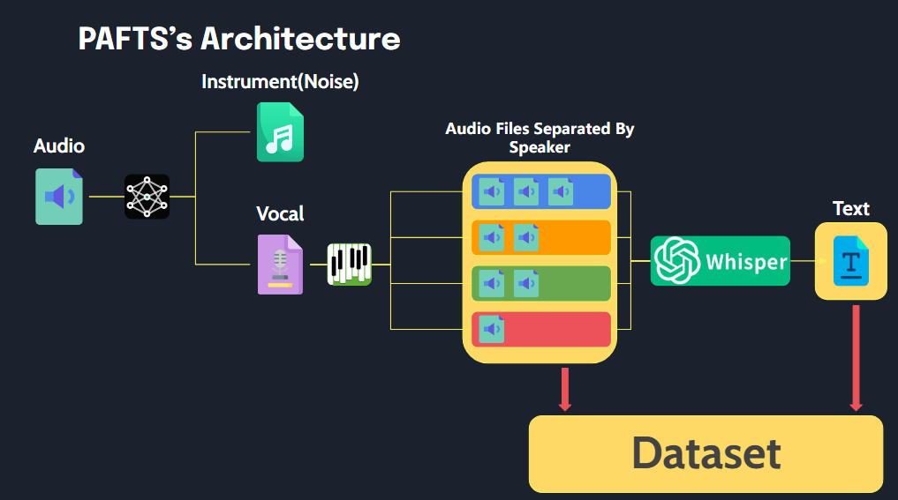

# PAFST


---

### Library That Preprocessing Audio For TTS.
This library enables easy processing of audio files into a format suitable for TTS training data with a simple execution.


## Description 
PAFST have three features.

1. Separator and Denoiser
2. VAD
3. Diarization
4. STT

* Separator or Denoiser : Removes background music (MR) and noise from each audio file to isolate clean voice tracks.
* VAD : Detects whether the audio is present or absent.
* Diarization : Separates speakers within each audio file, identifying distinct voices.
* STT : Extract text from audio.


```
# before run()

      path
        ├── TEST-1.wav # have mr or noise
        └── TEST-2.wav
        


# after run()
    
       path
        ├── SPEAKER_00
        │   ├── SPEAKER_00_1.wav # removed mr and noise
        │   ├── SPEAKER_00_2.wav
        │   └── SPEAKER_00_3.wav
        ├── SPEAKER_01
        │   ├── SPEAKER_01_1.wav
        │   └── SPEAKER_01_2.wav
        ├── SPEAKER_02
        │   ├── SPEAKER_02_1.wav
        │   └── SPEAKER_02_2.wav
        └── diarization.json
        
        # diarization.json
        [
              {
                "speaker_path": "/processed_audio/speaker_SPEAKER_00/SPEAKER_00_0.wav",
                "audio_filepath": "processed_audio//TEST-1.wav", # this is audio separated
                "start_time": 0.03,
                "end_time": 3.81
              },
            ...
      ]

      # asr.json
      [
            {
              "asr_text": " Let's talk about music. I often do you listen to music.",
              "audio_filepath": "/processed_audio/speaker_SPEAKER_00/SPEAKER_00_0.wav",
              "language": "en"
            } 
      ]
```


## Features
* Separator : Using the [UVR](https://github.com/Anjok07/ultimatevocalremovergui) project’s model and code for music source separation.
* Denoiser : DFNet3 and Facebook's ` denoiser `
* VAD : Using [webrtcvad](https://github.com/wiseman/py-webrtcvad)
* Diarization : Using speaker diarization from [pyannote-audio](https://github.com/pyannote/pyannote-audio)
* STT : Using STT model whisper from [OpenAI](https://github.com/openai/whisper) and ` faster-whisper `


## Setup
This library was developed using Python 3.10, and we recommend using Python versions 3.8 to 3.10 for compatibility.

While the library is compatible with both Linux and Windows, all testing was conducted on Linux. 
For any issues or errors encountered while running on Linux, please feel free to open an issue.

Before running the library, please ensure the following are installed:

### PyTorch
We highly recommend using a GPU to optimize performance. For PyTorch installation, please follow the commands below to ensure compatibility with your GPU
```
# Example for installing PyTorch with CUDA 11.8
pip install torch torchvision torchaudio --index-url https://download.pytorch.org/whl/cu118
```

### ffmpeg
[ffmpeg](https://ffmpeg.org/) is required for audio processing tasks within this library. Please ensure it is installed and accessible from your system’s PATH.
To install ffmpeg:

#### Windows
Download the latest FFmpeg release from [FFmpeg’s official website](https://ffmpeg.org/download.html), and add the bin folder to your system’s PATH.

#### Linux 
Use the following command to install FFmpeg:
```
sudo apt update
sudo apt install ffmpeg
```

After installation, you can verify by running
```
ffmpeg -version
```


### HuggingFace Access Token (required for diarization)
To enable diarization functionality, please complete the following steps
1. Accept [`pyannote/segmentation-3.0`](https://huggingface.co/pyannote/segmentation-3.0) user conditions
2. Accept [`pyannote/speaker-diarization-3.1`](https://huggingface.co/pyannote/speaker-diarization-3.1) user conditions
3. Create access token at [`hf.co/settings/tokens`](https://huggingface.co/login?next=%2Fsettings%2Ftokens).

```
from pafst.pafts import PAFST

p = PAFST(
    path = 'your_audio_directory_path',
    output_path = 'output_path',
    hf_token="HUGGINGFACE_ACCESS_TOKEN_GOES_HERE"
)

```

After completing the setup steps above, you can install this library by running
```
pip install pafst
```


## Usage
```
from pafst import PAFST

p = PAFST(
    path = 'your_audio_directory_path',
    output_path = 'output_path',
    hf_token="HUGGINGFACE_ACCESS_TOKEN_GOES_HERE" # if you use diarization
    
)

# Separator
p.separator() # or

p.denoiser(processor="dfn") # use "den" for facebook's denoiser

p.vad() # voice-activity-detection using webrtcvad

# Diarization
p.diarization()

# STT
p.stt(model_size='small')

# One-Click Process
p.run()

```

## TODO
- [ ] Command line
- [ ] Clean logging
- [ ] Separator with Model Selection

References:

* [PAFTS](https://github.com/harmlessman/PAFTS) for base code
* [Paper](https://arxiv.org/pdf/2409.05356) for DFNet3 use case

## License

The code of **PAFST** is [MIT-licensed](LICENSE)
